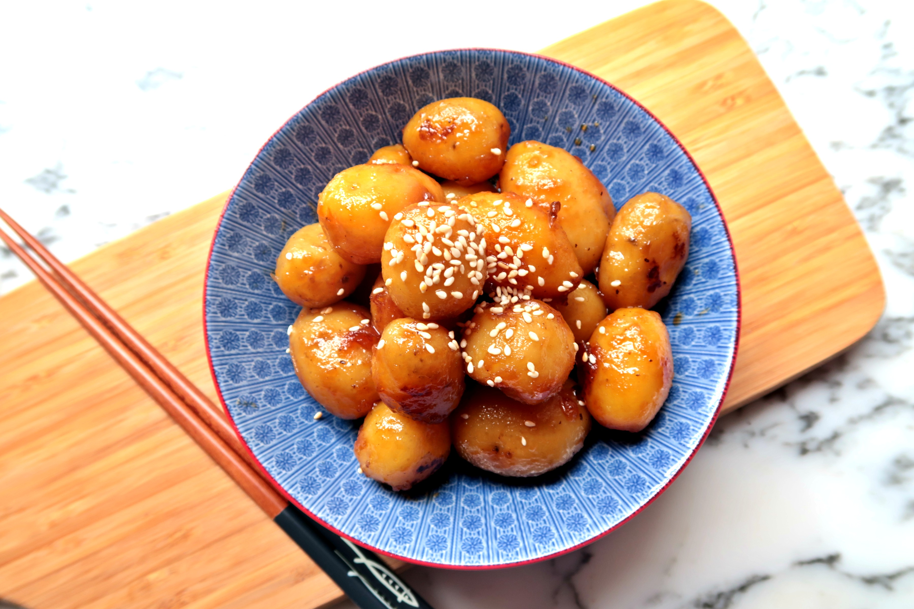

{ width=600 }

## 材料
- 薯仔 300g  
- 水 113g  
- 芝麻 1 tsp  
- 醬油 2.5 tbsp  
- 糖 1 tbsp  
- 蜜糖 1 tbsp  

## 做法
1. 鑊落少少油，煎香薯仔。  
2. 加入水、醬油、糖，轉細火冚蓋炆熟。  
3. 久不久反下面，約煮10分鐘，用筷子試熟度。  
4. 加入蜜糖拌勻，熄火。  
5. 最後灑上麻油與芝麻即可。  
