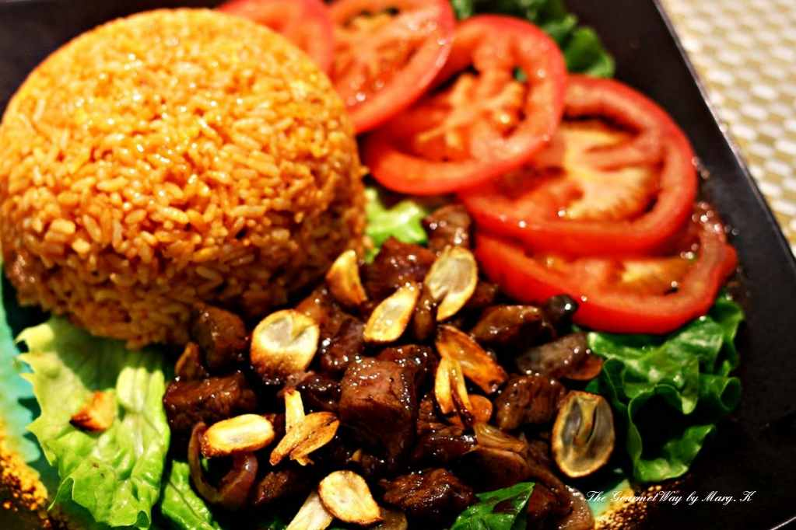

{ width=600 }

## 材料

### 牛肉醃料
- 魚露 4 tsp  
- 美極 4 tsp  
- Molasses 2 tsp  

### 紅飯
- 白米 300g（約 2 殼）
- 牛油 2 Tbsp
- 茄膏 3 Tbsp
- 水 414g
- 蒜粒 4 tsp
- 美極 2 tsp
- 鹽 1/2 tsp

### 其他
- 紅洋葱 1 個
- 蒜粒 2 tsp（炒牛肉用）
- 水 60g
- 粟粉 3/4 tsp
- 油 2 tsp
- 牛油 1 Tbsp

## 做法
1. 牛排切粒，以醃料醃 15 分鐘。  
2. 米洗淨瀝乾，以牛油炒香生米；加蒜粒、茄膏續炒。  
3. 加水、美極、鹽拌勻，煮飯（或電飯煲）。  
4. 取出牛肉備用；醃汁混入蒜粒與水拌勻。  
5. 牛肉加少油炒至有燶邊，盛起。  
6. 牛油下鍋炒洋葱至軟，倒入調好的醃汁；回鍋牛肉炒勻。  
7. 配紅飯上桌。  
