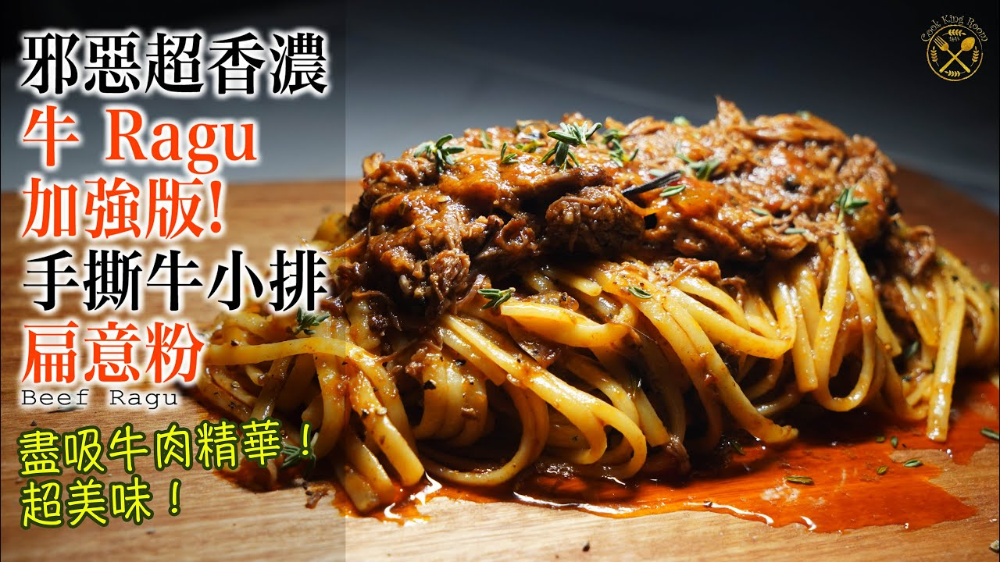

{ width=600 }

## 材料
- Short ribs 3條（連骨）
- 洋蔥 1個（切半再切成大塊）
- 乾蔥 2個
- 甘筍 1條（切大塊）
- 西芹 2條（切段）
- 蒜頭 8粒
- 茄膏 5湯匙
- 紅酒 2杯
- 喼汁 1湯匙
- 罐頭番茄 2罐
- 牛肉清湯 2杯
- Thyme 1紮
- 牛油 30–40g
- 意粉水 1殼

### 香料
- 八角 2粒
- 月桂葉 6片
- 丁香 4粒（可省）
- 黑椒粒 1/2湯匙

## 做法
1. Short ribs 去膜，煎前以鹽、胡椒稍醃。  
2. 香料以 120°C 焗爐烘香約 10 分鐘。  
3. 鑄鐵鍋少油，中高火將 short ribs 各面煎至上色後取出。  
4. 用餘油炒洋蔥、西芹、甘筍、乾蔥至微軟；加入茄膏炒香。  
5. 倒入紅酒，大火收一收酒香；加入喼汁。  
6. 加入罐頭番茄與牛肉清湯，放入香料（可用濾袋）與 short ribs（骨向下），再放 thyme。  
7. 煮滾後入焗爐 180°C 焖約 2 小時。  
8. 取出拌入牛油；視需要加少量意粉水收汁。  
9. 以黑胡椒調味，可配意粉或白飯。  

[YouTube - 燉牛小排](https://www.youtube.com/watch?v=2ht9s7EkaOI&t=2s)