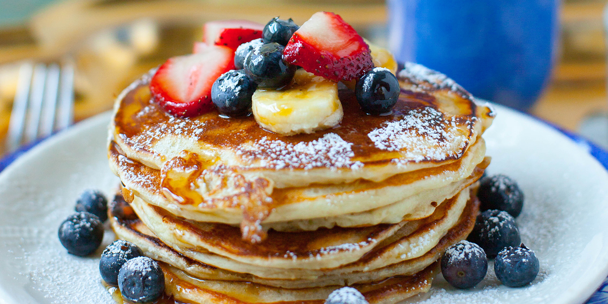

{ width=600 }

## 材料
**混合物 1**  
- 牛奶 386g（約 1.5 杯）  
- 雞蛋 1 隻  

**混合物 2**  
- 中筋麵粉 300g（2 杯）  
- 白砂糖 62g（1/4 杯）  
- 鹽 4g（1 茶匙）  
- 小蘇打 1g（1/4 茶匙）  
- 泡打粉 12g（1 湯匙）  

**混合物 3**  
- 牛油 21g（2 湯匙，溶）  

## 做法
1. 碗 A 拌勻混合物 1；碗 B 拌勻混合物 2。  
2. 將 A 倒入 B，稍拌至看不見乾粉（保留小顆粒）。  
3. 拌入溶化牛油（混合物 3），靜置 5 分鐘。  
4. 中小火煎至表面冒泡翻面，再煎至金黃。  
