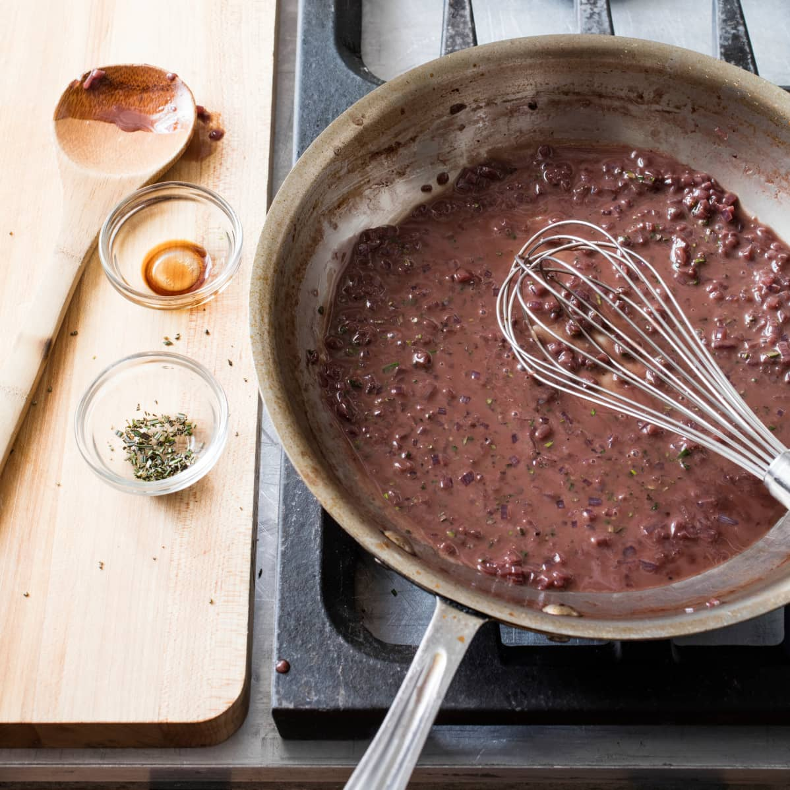

{ width=600 }

> **註：** 此配方只列出材料種類，不指定分量；請按鍋中汁量與口味調整。

## 材料（不標份量）
- 煎完牛排後的鍋底油汁（去多餘油）
- 紅蔥頭（切碎）
- 紅酒（或白酒）
- 黃糖或白糖
- 雞湯
- 牛油（收汁乳化）
- 迷迭香（切碎）
- 黑椒
- 黑醋（可選）

## 做法
1. 煎完牛扒，倒走多餘油，留鍋底油汁。  
2. 下紅蔥頭炒香。  
3. 加入紅／白酒收至糖漿狀。  
4. 加黃糖與雞湯，略收。  
5. 收汁至濃滑，離火加入牛油，用打蛋器乳化。  
6. 以迷迭香、黑椒與少許黑醋調味。  

[YouTube - Pan Sauce](https://www.youtube.com/watch?v=z8Y88GS7TSg&t=429s)