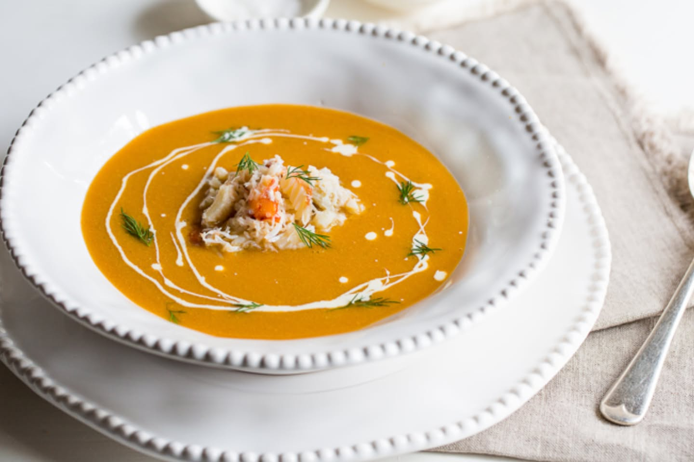

{ width=600 }

## 材料
- 西班牙紅蝦 4 隻
- 扁意粉 二人份量
- 洋蔥 半個
- 車厘茄 8 粒
- 鯷魚 1 條
- 紅椒 1 個
- 辣椒 半隻
- 蕃茄粒 半盒
- 百里香 適量
- 藏紅花 1 撮
- 蒜頭 2 粒
- 牛油 10g
- 海鹽、黑胡椒 適量
- 檸檬皮 適量

## 做法
1. 牛油起鑊爆香蒜頭、洋蔥與鯷魚，加入紅椒、辣椒炒香。  
2. 下車厘茄、蕃茄粒、百里香、藏紅花煮出香味。  
3. 加水成湯底煮滾，小火煮至入味；調味。  
4. 另鍋煮意粉至近熟。  
5. 紅蝦入湯略煮至剛熟，放入意粉同煮 1–2 分鐘，刨檸檬皮即可。  

[YouTube - 西班牙紅蝦湯](https://www.youtube.com/watch?v=m3ExPXXsoV0)